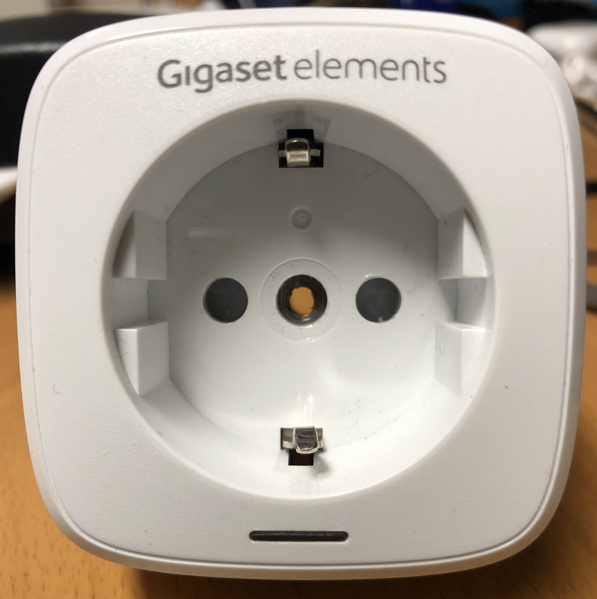

# Gigaset Smart Plug Tear Down
The main reason to do a tear down of this plug is to check out if it can be used for other things than simple on/off.

 by taking away the sticker covering the anti-theft screw `CR-V 3` bit of iFixit's Macro Bit Set. This way the top can be removed by using a plectrum of sorts at [these]() and at the opposite site [these]() locks. The top side can be removed.
Next is to [unscrew]() the two screws that hold the pins of the plug at the other end. The bottom part can be removed also leaving only the PCB's.

